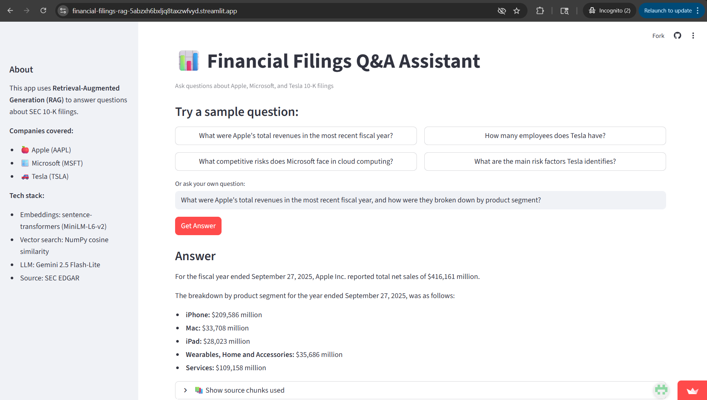

# 📊 Financial Filings Q&A Assistant

A Retrieval-Augmented Generation (RAG) application that answers natural-language questions about SEC 10-K filings for Apple, Microsoft, and Tesla — with source citations.

🔗 **[Live demo](https://[your-streamlit-url].streamlit.app)**

## What it does

Ask plain-English questions like *"What were Apple's total revenues last fiscal year?"* and get accurate answers grounded in the actual filings, not the LLM's memory. Every answer cites which company's filing it came from, and you can inspect the raw chunks the model used.

## Why I built this

I wanted to learn modern RAG architecture end-to-end — from raw data ingestion to a deployed user-facing app — using the same patterns enterprises use to build internal AI assistants. SEC filings are a realistic stand-in for any text-heavy enterprise corpus (contracts, policies, research reports).

## Architecture
SEC EDGAR API
↓
HTML Parsing (BeautifulSoup)
↓
Text Chunking (LangChain RecursiveCharacterTextSplitter, 1000 chars / 200 overlap)
↓
Embedding (sentence-transformers all-MiniLM-L6-v2)
↓
Vector Storage (NumPy arrays, normalized for cosine similarity)
↓
[User Question] → Embed → Retrieve top-k chunks → Pass to Gemini 2.5 Flash-Lite → Answer

## Key engineering decisions

- **NumPy over a vector DB**: At 28K chunks, ChromaDB-style infrastructure was overkill and introduced dependency conflicts in deployment. Plain NumPy cosine similarity gave sub-second retrieval with zero deps.
- **Pre-computed embeddings shipped with the app**: Avoids 2-minute cold start; embeddings are computed once in Colab and committed to the repo.
- **Company-aware retrieval**: Detect company keywords in the question and filter chunks before similarity search. Eliminated cross-company contamination in answers.
- **Grounded prompting**: System prompt instructs Gemini to refuse to answer if context is insufficient, preventing hallucination.

## Tech stack

| Layer | Tool |
|---|---|
| Data source | SEC EDGAR API |
| Embeddings | sentence-transformers (`all-MiniLM-L6-v2`) |
| Vector search | NumPy |
| LLM | Google Gemini 2.5 Flash-Lite |
| UI | Streamlit |
| Hosting | Streamlit Community Cloud |
| Notebook | Google Colab |

## Evaluation

Tested against 10 hand-written questions covering revenue figures, employee counts, risk factors, R&D spend, and strategy descriptions. Initial retrieval surfaced cross-company chunks for some queries; adding company-keyword filtering improved precision substantially.

## What I'd do next

- **Hybrid search**: Combine semantic similarity with BM25 keyword search for queries with specific financial terms
- **Re-ranking**: Use a cross-encoder to re-order top-20 retrieved chunks before sending to LLM
- **Evaluation harness**: Automated scoring against a labeled question/answer set
- **Multi-document reasoning**: Currently each answer comes from one company; extend to comparative questions ("How does Apple's R&D spending compare to Microsoft's?")
- **Migrate to Vertex AI**: Move to Vertex AI Vector Search and Gemini on Vertex for an enterprise-ready GCP deployment

## Run locally

\`\`\`bash
git clone https://github.com/[your-username]/financial-filings-rag
cd financial-filings-rag
pip install -r requirements.txt
echo 'GEMINI_API_KEY = "your-key"' > .streamlit/secrets.toml
streamlit run app.py
\`\`\`

## Acknowledgments

Built as a self-directed learning project to understand RAG systems hands-on.
